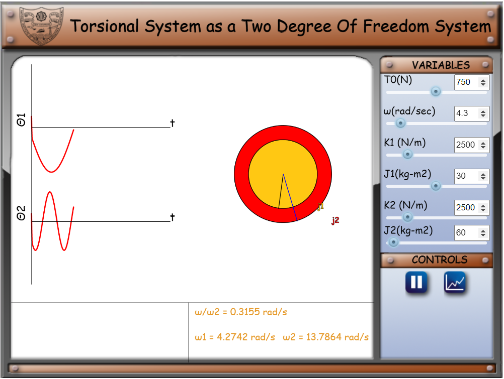
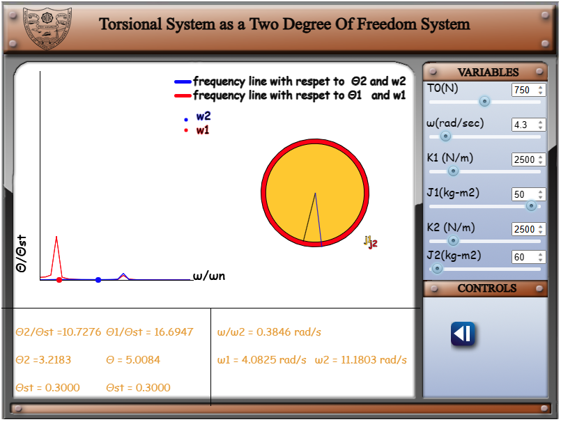
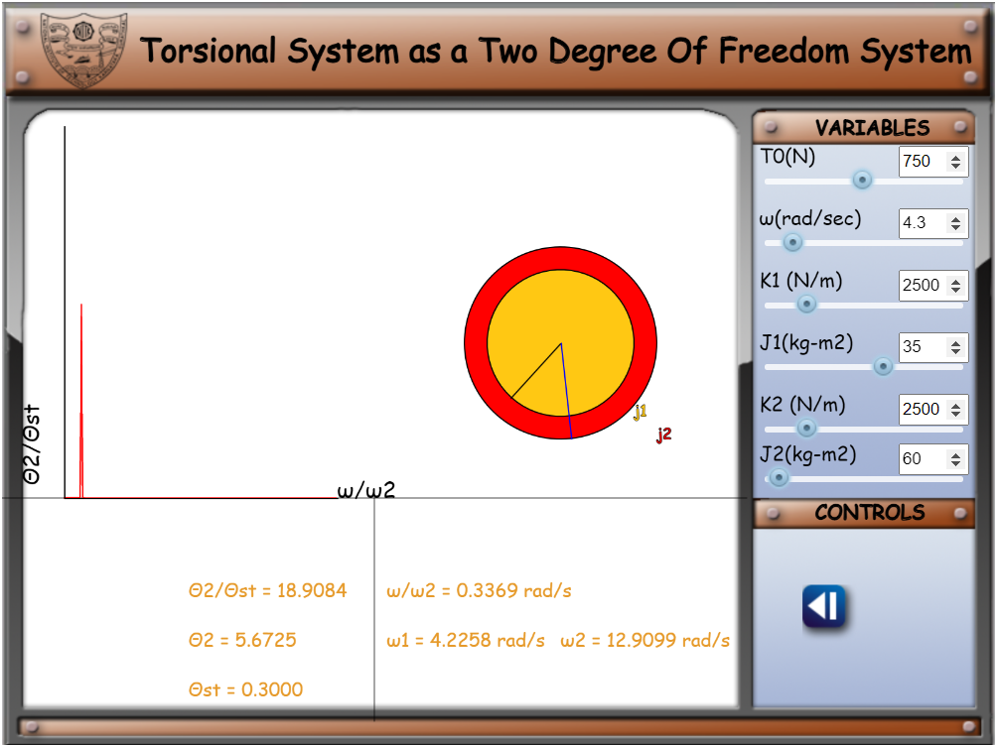

1. Clicking on the simulation tab will get the user to the first page where, Torsional load - t0, frequency-&omega;, stifness of rotor 1-k1, polar momenet of inertia of rotor 1 - J1, stifness of rotor 2-k2 and polar momenet of inertia of rotor 2 - J2

2. The simulation will change as the values are changed, clicking on the graph button, next to play/pause button will show the frequency response curve of the first rotor.

3. Clicking on the same button again will show the frequency response of the second rotor.

