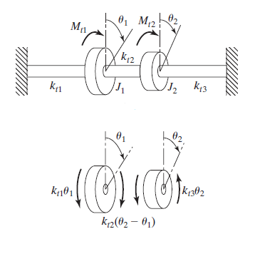
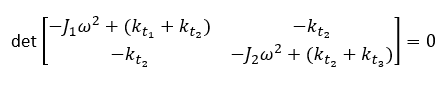
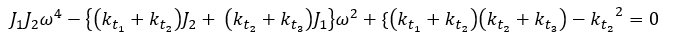
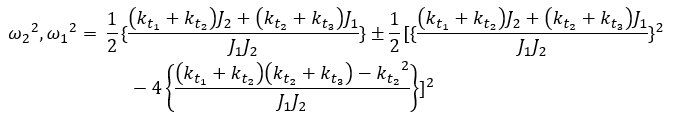

A torsional system consists of two discs which are mounted on a shaft as shown in Fig. 1.

The shaft can be divided into three segments, having rotational spring constants as kt1, kt2 and kt3. The system also has
 * Mass moment of inertia J1 and J2,  * Torque Mt1 and Mt2
 * Rotational degree of freedom &theta;1 and &theta;2.

  The differential equations of rotational motion for the discs can be written as,

Substituting for &theta;1 and &theta;2, and equating the detrminant to zero,

And,

The roots of the equations are,

which are the natural frequencies of the system.
