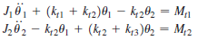

A torsional system consists of two discs mounted on a shaft, as shown in Fig. 1.

Fig 1. Two DOF Torsional System

The shaft can be divided into three segments, having rotational spring constants as kt1, kt2, and kt3, as shown in Figure 1.
 * Mass moment of inertia of the discs are J1 and J2, and Mt1 and Mt2 are the applied torque and the rotational degree of freedoms are &theta;1 and &theta;2.  

  The differential equations of rotational motion for the discs can be written as,

Consider a harmonic oscillation where &theta;i = &Theta;i sin &omega;t. The frequencies can be obtained by equating the determinant to zero,

And,

Which is the characteristic equation. 
The roots of the equations are,

where &omega;1 and &omega;2 are the natural frequencies of the system.