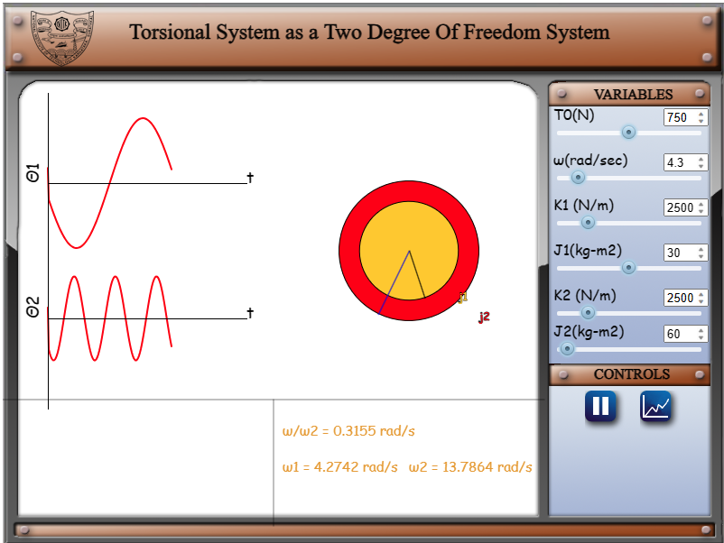

Given Data:
1. T0 - Torque (Nm)
2. &omega; - Input Angular Frequency (rad/s)
3. k1 - Stiffness of Disc 1 (Nm/rad)
4. J1 - Polar Moment of Inertia of Disc 1 (kgm2)
5. k2 - Stiffness of Disc 2 (NM/rad)
6. J2 - Polar Moment of Inertia Disc 2 (kgm2)

The experiment is based on the theory of torsional vibrations of a two-degree-of-freedom system, wherein the discs are represented in terms of their moment of inertia. These oscillations can be changed by varying  T0, &omega;, k1, J1, k2, and J2. 

1. Clicking on the simulation tab will open the simulator with the discs oscillating with default values.

 

Change the values to observe different responses of the system.

2. Clicking on the graph button will show the frequency response curves

 

Click on the back button to view the first page.
