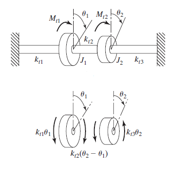
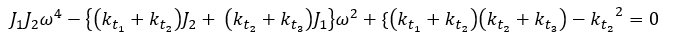
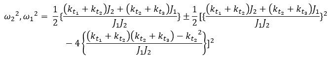

A torsional system consists of two discs mounted on a shaft, as shown in Fig. 1.

Fig 1. Two DOF Torsional System

The shaft can be divided into three segments, having rotational spring constants as $k_{t1}$, $k_{t2}$, and $k_{t3}$, as shown in Figure 1.  

Mass moment of inertia of the discs are $J_1$ and $J_2$, and $M_{t1}$ and $M_{t2}$ are the applied torque and the rotational degree of freedoms are $\theta_1$ and $\theta_2$.    

The differential equations of rotational motion for the discs can be written as,

<!--  -->

$J₁θ̈₁ + (k_{t1} + k_{t2})θ₁ - k_{t2}θ₂ = M_{t1}$  
$J₂θ̈₂ - k_{t2}θ₁ + (k_{t2} + k_{t3})θ₂ = M_{t2}$

Consider a harmonic oscillation where $\theta_i = \Theta_i \sin\omega t$. The frequencies can be obtained by equating the determinant to zero,

<!--  -->

$$
\det \begin{bmatrix}
-J_1\omega^2 + (k_{t_1} + k_{t_2}) & -k_{t_2} \\
-k_{t_2} & -J_2\omega^2 + (k_{t_2} + k_{t_3})
\end{bmatrix} = 0
$$

And,

<!--  -->

$J_1J_2\omega^4 - \left\{ (k_{t_1} + k_{t_2})J_2 + (k_{t_2} + k_{t_3})J_1 \right\} \omega^2 + \left\{ (k_{t_1} + k_{t_2})(k_{t_2} + k_{t_3}) - k_{t_2}^2 \right\} = 0$

Which is the characteristic equation.
The roots of the equations are,

<!--  -->

$\omega_2^2, \omega_1^2 = \frac{1}{2}\left\{ \frac{(k_{t_1} + k_{t_2})J_2 + (k_{t_2} + k_{t_3})J_1}{J_1J_2} \right\} \pm \frac{1}{2}\left[ \left\{ \frac{(k_{t_1} + k_{t_2})J_2 + (k_{t_2} + k_{t_3})J_1}{J_1J_2} \right\}^2 - 4\left\{ \frac{(k_{t_1} + k_{t_2})(k_{t_2} + k_{t_3}) - k_{t_2}^2}{J_1J_2} \right\} \right]^{\frac{1}{2}}$

where $\omega_1$ and $\omega_2$ are the natural frequencies of the system.